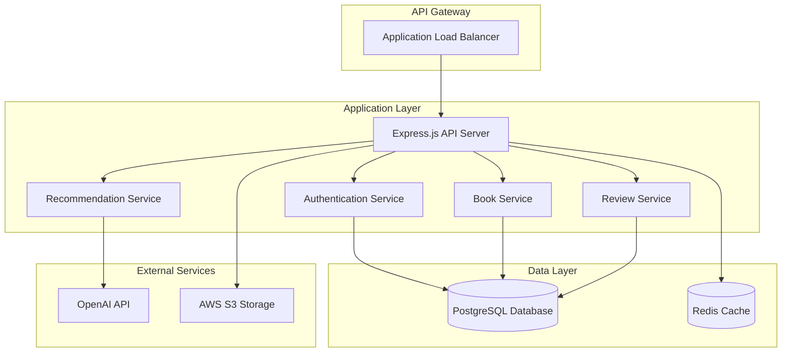
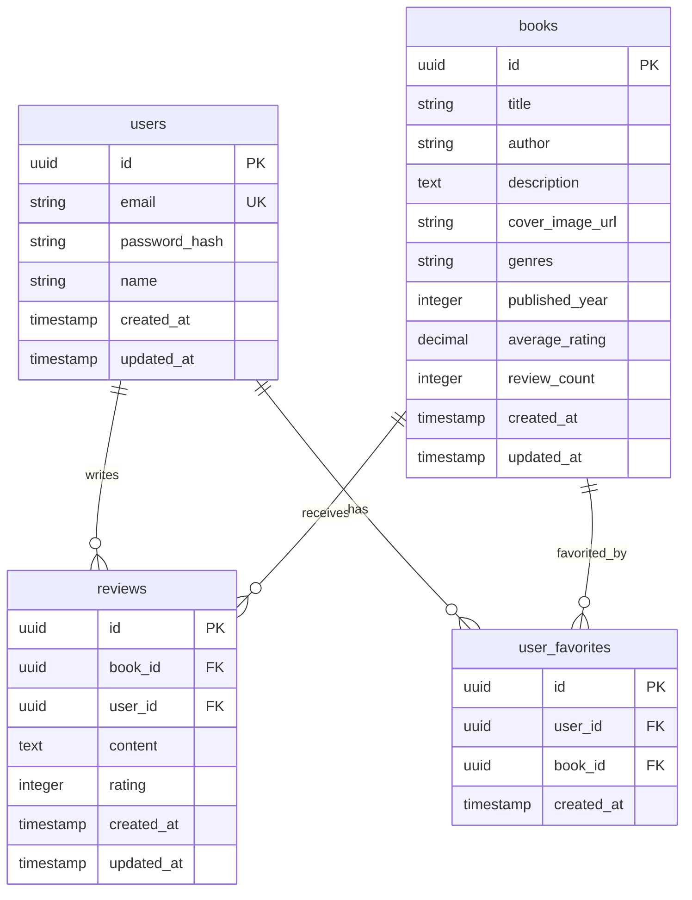

# Backend Design Document

## Overview

The Book Review Platform backend will be built as a scalable RESTful API service using Node.js and TypeScript. The system will leverage cloud-native technologies, implement comprehensive testing strategies, and use infrastructure as code for reliable deployments.

### Technology Stack

**Backend:**
- **Runtime:** Node.js with TypeScript for type safety and developer experience
- **Framework:** Express.js with middleware for authentication, validation, and error handling
- **Database:** PostgreSQL for relational data with proper indexing for performance
- **Authentication:** JWT tokens with bcrypt for password hashing
- **ORM:** Prisma for type-safe database operations and migrations
- **Testing:** Jest with Supertest for API testing
- **Documentation:** OpenAPI/Swagger for API documentation

**Infrastructure:**
- **Cloud Provider:** AWS for scalable cloud infrastructure
- **Containerization:** Docker for consistent deployment environments
- **Orchestration:** AWS ECS or EKS for container management
- **Database:** AWS RDS PostgreSQL with automated backups
- **Storage:** AWS S3 for static assets and book cover images
- **CDN:** AWS CloudFront for global content delivery
- **Monitoring:** AWS CloudWatch for logging and monitoring

## Architecture

### System Architecture



### Database Schema



## API Design

### Authentication Module
```typescript
interface AuthService {
  register(userData: RegisterRequest): Promise<AuthResponse>
  login(credentials: LoginRequest): Promise<AuthResponse>
  validateToken(token: string): Promise<User>
  refreshToken(refreshToken: string): Promise<AuthResponse>
}

interface AuthController {
  POST /api/auth/register
  POST /api/auth/login
  POST /api/auth/logout
  POST /api/auth/refresh
  GET /api/auth/me
}
```

### Book Management Module
```typescript
interface BookService {
  getAllBooks(pagination: PaginationParams, filters: BookFilters): Promise<PaginatedBooks>
  getBookById(id: string): Promise<Book>
  searchBooks(query: string, filters: SearchFilters): Promise<Book[]>
  updateBookRating(bookId: string): Promise<void>
}

interface BookController {
  GET /api/books
  GET /api/books/:id
  GET /api/books/search
}
```

### Review Management Module
```typescript
interface ReviewService {
  createReview(reviewData: CreateReviewRequest): Promise<Review>
  getReviewsByBook(bookId: string): Promise<Review[]>
  getReviewsByUser(userId: string): Promise<Review[]>
  updateReview(reviewId: string, updateData: UpdateReviewRequest): Promise<Review>
  deleteReview(reviewId: string): Promise<void>
}

interface ReviewController {
  POST /api/reviews
  GET /api/reviews/book/:bookId
  GET /api/reviews/user/:userId
  PUT /api/reviews/:id
  DELETE /api/reviews/:id
}
```

### User Profile Module
```typescript
interface UserService {
  getUserProfile(userId: string): Promise<UserProfile>
  addToFavorites(userId: string, bookId: string): Promise<void>
  removeFromFavorites(userId: string, bookId: string): Promise<void>
  getUserFavorites(userId: string): Promise<Book[]>
}

interface UserController {
  GET /api/users/profile
  POST /api/users/favorites/:bookId
  DELETE /api/users/favorites/:bookId
  GET /api/users/favorites
}
```

### Recommendation Module
```typescript
interface RecommendationService {
  getPersonalizedRecommendations(userId: string): Promise<Recommendation[]>
  generateRecommendationPrompt(userProfile: UserProfile): string
  callOpenAIAPI(prompt: string): Promise<OpenAIResponse>
  fallbackRecommendations(): Promise<Book[]>
}

interface RecommendationController {
  GET /api/recommendations
}
```

## Data Models

### Core Data Types

```typescript
interface User {
  id: string
  email: string
  name: string
  createdAt: Date
  updatedAt: Date
}

interface Book {
  id: string
  title: string
  author: string
  description: string
  coverImageUrl: string
  genres: string[]
  publishedYear: number
  averageRating: number
  reviewCount: number
  createdAt: Date
  updatedAt: Date
}

interface Review {
  id: string
  bookId: string
  userId: string
  content: string
  rating: number
  createdAt: Date
  updatedAt: Date
  user?: User
  book?: Book
}

interface UserFavorite {
  id: string
  userId: string
  bookId: string
  createdAt: Date
}

interface Recommendation {
  book: Book
  reason: string
  confidence: number
}
```

### API Request/Response Types

```typescript
interface RegisterRequest {
  email: string
  password: string
  name: string
}

interface LoginRequest {
  email: string
  password: string
}

interface AuthResponse {
  user: User
  token: string
  refreshToken: string
}

interface CreateReviewRequest {
  bookId: string
  content: string
  rating: number
}

interface PaginationParams {
  page: number
  limit: number
}

interface BookFilters {
  genres?: string[]
  minRating?: number
  publishedYear?: number
}
```

## Error Handling

### Backend Error Strategy

```typescript
class AppError extends Error {
  statusCode: number
  isOperational: boolean
  
  constructor(message: string, statusCode: number) {
    super(message)
    this.statusCode = statusCode
    this.isOperational = true
  }
}

interface ErrorResponse {
  success: false
  error: {
    message: string
    code: string
    details?: any
  }
}

// Global error handling middleware
const globalErrorHandler = (err: Error, req: Request, res: Response, next: NextFunction) => {
  // Log error details
  // Return appropriate error response
  // Handle different error types (validation, authentication, database, etc.)
}
```

## Testing Strategy

### Backend Testing Approach

#### Unit Tests (Target: 90% coverage)
```typescript
// Service layer tests
describe('BookService', () => {
  test('should create book review successfully', async () => {
    // Test business logic in isolation
  })
  
  test('should handle duplicate review creation', async () => {
    // Test error scenarios
  })
})

// Repository layer tests with database mocking
describe('BookRepository', () => {
  test('should retrieve books with pagination', async () => {
    // Test data access layer
  })
})
```

#### Integration Tests (Target: 80% coverage)
```typescript
// API endpoint tests
describe('POST /api/reviews', () => {
  test('should create review with valid authentication', async () => {
    // Test complete request flow
  })
  
  test('should reject unauthenticated requests', async () => {
    // Test authentication middleware
  })
})
```

#### External Service Tests
```typescript
// OpenAI API integration tests with mocking
describe('RecommendationService', () => {
  test('should handle OpenAI API success response', async () => {
    // Mock external API calls
  })
  
  test('should fallback when OpenAI API fails', async () => {
    // Test error handling and fallback logic
  })
})
```

### Testing Infrastructure

```typescript
// Test configuration
interface TestConfig {
  database: {
    url: string // Test database URL
    resetBetweenTests: boolean
  }
  mocks: {
    openaiApi: boolean
    s3Upload: boolean
  }
  coverage: {
    threshold: {
      global: 80
      functions: 80
      lines: 80
      statements: 80
    }
  }
}
```

## Performance and Scalability

### Caching Strategy
- **Redis Cache:** Cache frequently accessed book data, user sessions, and recommendation results
- **Application-level Caching:** Cache computed average ratings and popular books
- **CDN Caching:** Cache static assets and book cover images through CloudFront

### Database Optimization
- **Indexing:** Create indexes on frequently queried fields (book title, author, user email)
- **Connection Pooling:** Implement database connection pooling for efficient resource usage
- **Query Optimization:** Use Prisma's query optimization features and monitor slow queries

### API Performance
- **Rate Limiting:** Implement rate limiting to prevent abuse
- **Pagination:** Use cursor-based pagination for large datasets
- **Response Compression:** Enable gzip compression for API responses
- **Async Processing:** Use background jobs for heavy operations like recommendation generation

### Monitoring and Observability
- **Application Metrics:** Track API response times, error rates, and throughput
- **Database Metrics:** Monitor query performance and connection pool usage
- **Alert System:** Set up alerts for critical errors and performance degradation

## Security Considerations

### Authentication Security
- **Password Hashing:** Use bcrypt with appropriate salt rounds
- **JWT Security:** Implement proper token expiration and refresh mechanisms
- **Session Management:** Secure token storage and invalidation

### API Security
- **Input Validation:** Validate and sanitize all user inputs
- **Rate Limiting:** Prevent abuse through request rate limiting
- **CORS Configuration:** Proper cross-origin resource sharing setup
- **Error Handling:** Avoid exposing sensitive information in error responses

### Infrastructure Security
- **Network Security:** Use VPCs and security groups for network isolation
- **Database Security:** Encrypt data at rest and in transit
- **Secrets Management:** Use AWS Secrets Manager for sensitive configuration
- **Access Control:** Implement least privilege access principles

This design provides a solid foundation for building a scalable, maintainable backend API that meets all the specified requirements while following modern development best practices.